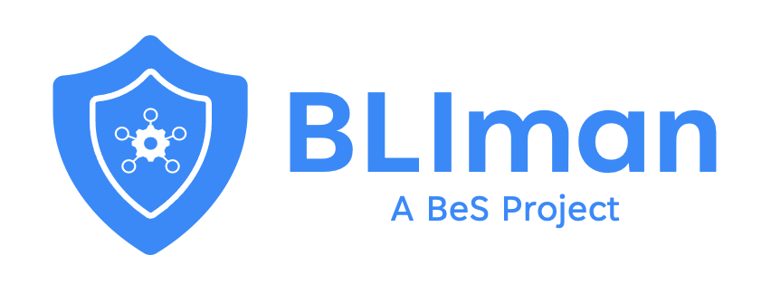

BLIman is a command line interface for managing [BeSLab](https://github.com/Be-Secure/BeSLab) deployments. It can be used to bring up the lab in 3 different modes. 

* Lite Mode 
* <i>Host Mode (Work in progress)</i>
* <i>Bare Mode (Work in progress)</i>

In addition, there are 3 deployment types for each lab mode.
* Private Lab - Owned by an organization for commercial usage.
* <i>Public Lab (Work in progress) - Community lab hosted in any public code collaboration repository.</i>
* <i>Personal Lab (Work in progress) - Owned by an individual for learning and research purpose.</i>

It is recommended to have an understanding of [BeSLab](https://github.com/Be-Secure/BeSLab) and its genesis.yaml file.

## Installing BLIman
Bliman version details [here](https://github.com/Be-Secure/BLIman/releases).

1. Open your terminal
2. Download the setup script
    `curl -o bliman_setup.sh https://raw.githubusercontent.com/Be-Secure/BLIman/main/bliman_setup.sh`
    `chmod +x bliman_setup.sh`
    `source bliman_setup.sh install --version <bliman release version>`
    `source $HOME/.bliman/bin/bliman-init.sh`

## BLIman Usage

BLIman helps you to set up and manage the BeSLab deployments. It can bring up a BeSLab in 3 modes.

**Lite mode**

Currently, BLIman supports only Lite mode Private deployment type only. The other two modes and type of deployments are work in progress.

1. Open your terminal
2. Make sure you have bliman installed and running.
    `bli help`
3. Prepare the lab deployment.
    `bli load` - This command needs to be executed from the directory where genesis.yaml file for the BeSLab is present.
    `bli initmode lite`
4. Launch the lab deployment.
    `source $HOME/.besman/bin/besman-init.sh`
    `bli launchlab`
